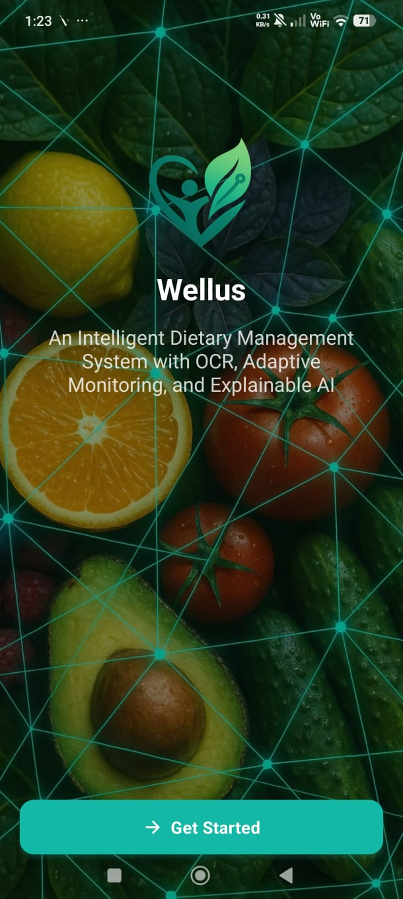
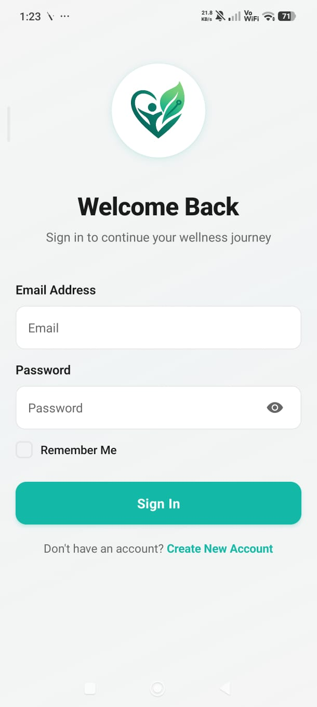
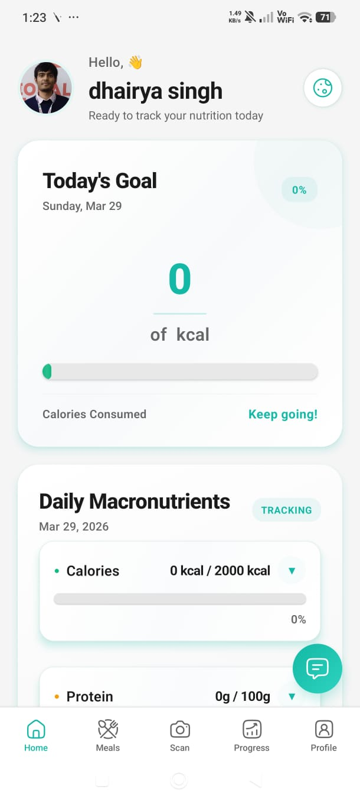
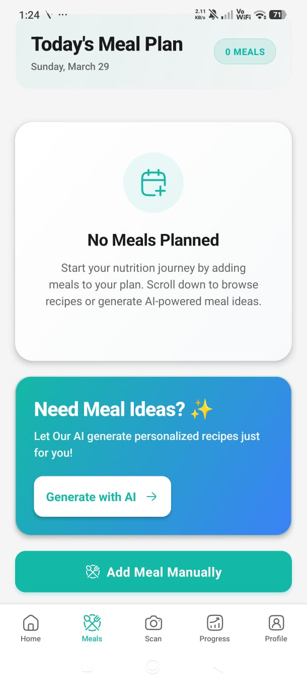
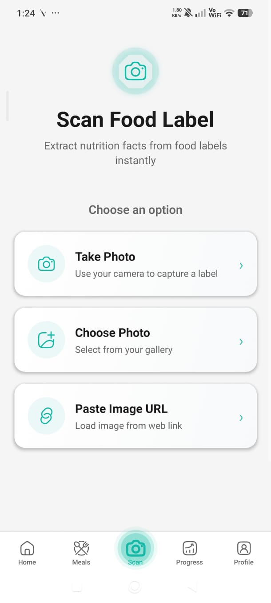
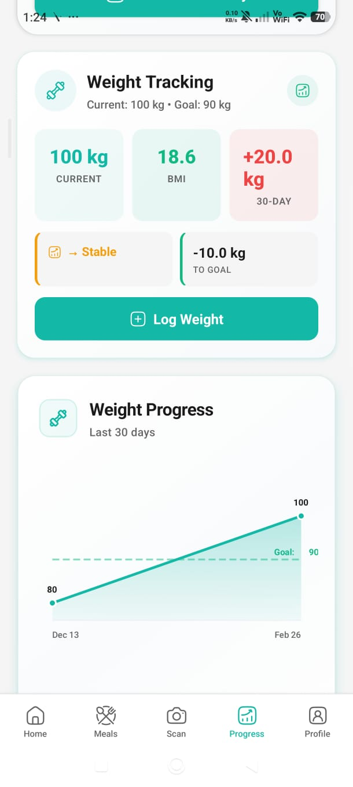
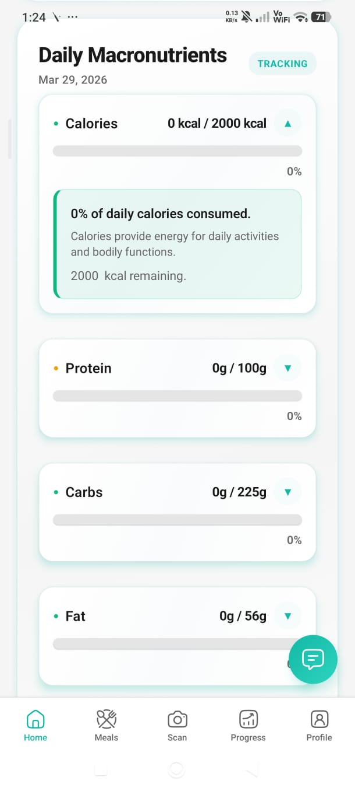
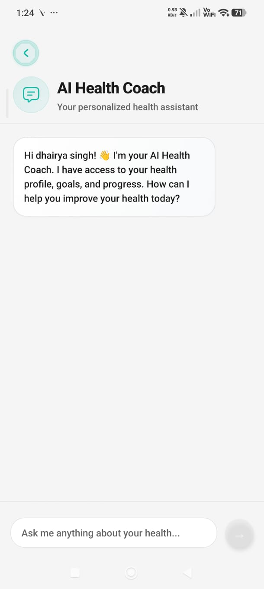
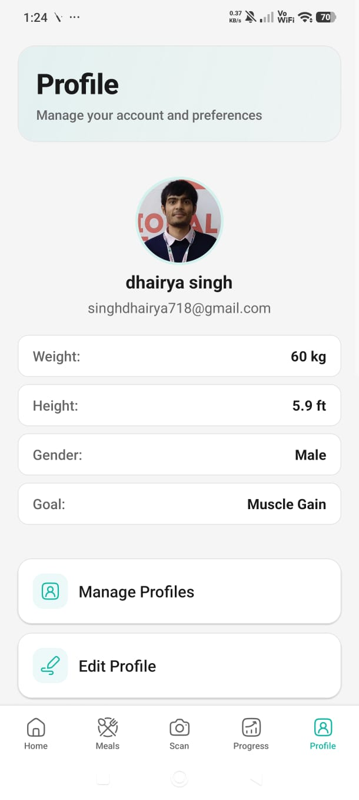

# Wellus - Intelligent Nutrition Tracking App

<div align="center">

**An AI-powered mobile application for personalized nutrition tracking, meal planning, and dietary management**

[](https://reactnative.dev/)
[](https://expo.dev/)
[](https://convex.dev/)

</div>

## 📱 Overview

Wellus is a comprehensive nutrition tracking application that combines OCR technology, AI-powered meal planning, and adaptive monitoring to help users achieve their health goals. The app features food label scanning, weight tracking, exercise logging, and detailed progress analytics.

## 📸 App Screenshots

<p align="center">
  
  
  
</p>

<p align="center">
  
  
  
</p>

<p align="center">
  
  
  
</p>

## 📝 Recent updates

- **Convex-first AI** — Core AI flows (health coach, recipe generation, calorie estimation, nutrition parsing from text/image) run as **Convex actions** so API keys stay server-side. Configure **`OPENAI_API_KEY`** in the [Convex dashboard](https://dashboard.convex.dev) for your deployment (not only in local `.env`).
- **Release builds and env** — Store and EAS-built APKs do **not** ship `.env.local`. Set **`EXPO_PUBLIC_*`** variables in **Expo → Project → Environment variables** (e.g. `production`) so the app has `EXPO_PUBLIC_CONVEX_URL`, Firebase, EAS project id, and optional OCR / image API keys at build time. Root layout shows a clear message if Convex URL is missing.
- **Shared Convex client** — `utils/convexClient.js` centralizes the Convex client for services that call actions from the app.
- **EAS profiles** — `eas.json` includes **`production-apk`** (production settings + Android **APK** for sideloading) alongside `development` (dev client + APK) and `production` (Play Store **AAB**).
- **OCR and reliability** — OCR pipeline and related services updated for Convex-backed tiers, caching, and error handling where applicable.
- **Notifications** — `utils/expoNotificationsGate.js` helps gate notification behavior for safer startup paths.
- **App polish** — Updates across auth, tabs (Home, Profile, Scan), meal reminders, AI recipe flow, health coach UI, meal plan cards, weight tracker, and related Convex functions.

## ✨ Key Features

### 🎯 Core Features
- **📸 OCR Food Label Scanning** - Extract nutrition data from food labels using ML Kit (offline) and cloud OCR APIs
- **🤖 AI-Powered Meal Planning** - Generate personalized recipes based on dietary goals and preferences
- **⚖️ Weight Tracking** - Track weight over time with progress charts, goal setting, and trend predictions
- **🏃 Exercise Tracking** - Log exercises and track calories burned
- **📊 Progress Analytics** - Weekly trends, macronutrient tracking, and detailed insights
- **💧 Water Intake Tracking** - Monitor daily hydration goals
- **🔔 Meal Reminders** - Customizable reminders for meals and water intake

### 🧠 Advanced Features
- **Adaptive Monitoring** - Pattern detection for eating habits and personalized recommendations
- **Explainable AI (XAI)** - Clear explanations for nutrition recommendations
- **Multi-Profile Support** - Manage multiple user profiles
- **Dark Mode** - Full dark mode support
- **Offline OCR** - ML Kit Text Recognition works completely offline
- **Calorie-Weight Correlation** - Analyze relationship between calorie intake and weight changes

## 🛠️ Tech Stack

### Frontend
- **React Native** - Cross-platform mobile framework
- **Expo** - Development platform and tooling
- **Expo Router** - File-based routing
- **React Native Reanimated** - Smooth animations
- **React Native SVG** - Chart rendering

### Backend & Services
- **Convex** - Backend-as-a-Service (database, real-time queries, mutations, **server-side AI actions**)
- **Firebase** - Authentication (email/password)
- **OpenAI** - Used inside **Convex** for chat-based AI (keys live in Convex env, not in the shipped JS bundle)
- **ML Kit** - On-device text recognition (bundled with app)

### OCR Services
- **ML Kit Text Recognition** (Primary - Offline, bundled)
- **OCR.space API** (Fallback)
- **Google Vision API** (Fallback)
- **Azure Computer Vision** (Fallback)

## 📋 Prerequisites

- **Node.js** 18+ and **npm**
- **Git** (optional but typical if you clone from GitHub)
- **Expo account** (free) at [expo.dev](https://expo.dev) — required for **EAS Build** (APK/AAB)
- **Convex account** (free tier) at [convex.dev](https://convex.dev)
- **Firebase** project for Email/Password authentication
- **OpenAI API key** (billing may apply for sustained use) — configured in **Convex**, not shipped in the client bundle
- **Device**: physical Android/iPhone, or **Android Emulator** / **iOS Simulator** (macOS)

> **Note:** Some native capabilities (for example parts of the OCR stack) require a **development build**, not the stock Expo Go client. Production builds produced by EAS include the native code defined in `app.json` and your plugins.

---

## 🚀 Getting Started

Clone this repository (or download it as a ZIP from GitHub and extract), then work from the **project root** — the directory that contains `package.json`.

### Install dependencies

```bash
git clone https://github.com/singhdhairya17/wellus-app.git
cd wellus-app
npm install
```

If you did not use Git, unpack the archive, `cd` into the `wellus-app` folder, and run `npm install` there.

---

### Convex backend

Convex provides the database, server functions, and **server-side AI** (`convex/Ai.js`). **Use your own Convex project** so your data and API keys stay private and isolated.

1. Create an account at [convex.dev](https://convex.dev) and add a **new project**.
2. From the project root, authenticate and sync functions (first machine only needs login once):

   ```bash
   npx convex login
   npx convex dev
   ```

   That pushes the `convex/` code and prints a **deployment URL** (for example `https://xxxxx.convex.cloud`).

3. Use that value as **`EXPO_PUBLIC_CONVEX_URL`** in `.env.local` (see below).

4. **OpenAI (required for AI features)** — In the [Convex Dashboard](https://dashboard.convex.dev) → your project → **Settings → Environment variables**, add:

   | Variable           | Purpose |
   |--------------------|--------|
   | `OPENAI_API_KEY`   | Used by Convex actions in `convex/Ai.js` (health coach, recipes, nutrition parsing, vision). |

   Deployments stay current with `npx convex dev` (development) or **`npx convex deploy`** (production / CI).

5. The schema and functions in this repo apply automatically when Convex syncs.

---

### Firebase (authentication)

The app uses **Firebase Authentication** with **Email/Password**.

1. Open [Firebase Console](https://console.firebase.google.com) and create or select a project.
2. Enable **Authentication** → **Sign-in method** → **Email/Password**.
3. Under project settings → **Your apps**, register a **Web** app and copy the **`firebaseConfig`** object.

4. Edit **`services/FirebaseConfig.jsx`** and replace the entire **`firebaseConfig`** object with your Web app values (`apiKey`, `authDomain`, `projectId`, `storageBucket`, `messagingSenderId`, `appId`, `measurementId` when present).

5. Set **`EXPO_PUBLIC_FIREBASE_API_KEY`** in `.env.local` to the same **`apiKey`** string.

Never commit production secrets. Keep keys in `.env.local`, your CI secrets, or the Expo dashboard for release builds — not in Git history.

---

### Environment variables (`.env.local`)

Create **`.env.local`** in the **project root**. Git ignores it by default. Expo loads it when you run **`npx expo start`**. **Release binaries do not embed this file**; configure **`EXPO_PUBLIC_*`** on [expo.dev](https://expo.dev) for EAS builds (see below).

```env
EXPO_PUBLIC_CONVEX_URL=https://your-deployment.convex.cloud
EXPO_PUBLIC_FIREBASE_API_KEY=your_firebase_web_api_key
EXPO_PUBLIC_EAS_PROJECT_ID=your-expo-project-uuid

# OPENAI_API_KEY belongs in the Convex dashboard only — not here.

# Optional OCR fallbacks
# EXPO_PUBLIC_GOOGLE_VISION_API_KEY=
# EXPO_PUBLIC_AZURE_VISION_API_KEY=
# EXPO_PUBLIC_AZURE_VISION_ENDPOINT=

# Optional debugging
# EXPO_PUBLIC_OCR_DEBUG=1

# Optional recipe image API
# EXPO_PUBLIC_AIRGURU_LAB_API_KEY=
```

Restart the Metro bundler after edits (`Ctrl+C`, then `npx expo start`).

---

### Run the app locally

Run **Convex** and **Expo** at the same time (two terminals, project root):

```bash
# Terminal A
npx convex dev
```

```bash
# Terminal B
npx expo start
```

Press **`a`** (Android), **`i`** (iOS), or scan the QR code with **Expo Go** or a **development build**.

If the UI shows **Missing Convex URL**, `EXPO_PUBLIC_CONVEX_URL` is unset or empty — fix `.env.local` and restart Expo.

---

### EAS project (cloud builds)

Cloud APK/AAB builds need the [EAS CLI](https://docs.expo.dev/build/setup/) and an Expo account:

```bash
npm install -g eas-cli
eas login
eas init
```

Link or create a project as prompted. Align **`EXPO_PUBLIC_EAS_PROJECT_ID`** with your Expo project if you rely on notification-related code paths. You may update **`app.json`** → **`extra.eas.projectId`** after linking.

---

### Environment variables for release builds

Stores and devices running an **EAS-built** binary never read `.env.local` from your computer. Define the same **`EXPO_PUBLIC_*`** names under your project on [expo.dev](https://expo.dev) → **Environment variables** / **Secrets**, scoped to **`production`** or **`preview`** as your `eas.json` profiles expect.

Minimum for a working build:

- `EXPO_PUBLIC_CONVEX_URL`
- `EXPO_PUBLIC_FIREBASE_API_KEY`
- `EXPO_PUBLIC_EAS_PROJECT_ID` (if your features depend on it)

Run a **new** build after changing variables. Keep **`OPENAI_API_KEY`** on the Convex deployment that matches `EXPO_PUBLIC_CONVEX_URL`.

---

### Devices and emulators

- **Expo Go / dev client**: QR code from the terminal, or **`a`** / **`i`** shortcuts.
- **Full native workflow**: see **Development build** below (`eas build --profile development` or `npx expo run:android` / `run:ios`).

## 🔧 Development Build (Required for ML Kit OCR)

For offline OCR functionality, you need a development build:

```bash
# Install dev client
npm install expo-dev-client --legacy-peer-deps

# Build for Android (using EAS)
eas build --profile development --platform android

# Or build locally
npx expo run:android
npx expo run:ios
```

**Note**: ML Kit Text Recognition model is bundled with the app (~10MB), so no download is needed at runtime.

## 📁 Project Structure

```
wellus-app/
├── app/                          # Expo Router screens
│   ├── (tabs)/                   # Main navigation tabs
│   │   ├── Home.jsx              # Dashboard
│   │   ├── Meals.jsx             # Meal planning
│   │   ├── Scan.jsx              # Food label scanning
│   │   ├── Progress.jsx          # Progress tracking
│   │   └── Profile.jsx            # User profile
│   ├── auth/                     # Authentication screens
│   ├── billing/                  # Billing management
│   ├── health-coach/             # AI health coach chat
│   └── meal-reminders/           # Reminder settings
│
├── components/                    # React components
│   ├── common/                   # Shared components
│   ├── dashboard/                # Dashboard components
│   ├── meals/                    # Meal planning components
│   ├── recipes/                  # Recipe components
│   ├── progress/                 # Progress charts
│   ├── tracking/                 # Weight, exercise, water tracking
│   └── ui/                       # UI components
│
├── services/                     # Business logic
│   ├── ai/                       # AI services (call Convex actions)
│   ├── ocr/                      # OCR services (ML Kit, APIs)
│   ├── monitoring/               # Adaptive monitoring
│   ├── calculation/              # Nutrition calculations
│   └── notifications/            # Push notifications
│
├── convex/                       # Backend (Convex)
│   ├── schema.js                 # Database schema
│   ├── Users.js                  # User management
│   ├── Recipes.js                # Recipe management
│   ├── MealPlan.jsx              # Meal planning
│   ├── Tracking.js               # Weight, exercise, water tracking
│   ├── Ai.js                     # Convex actions (OpenAI server-side)
│   └── _generated/               # Auto-generated files
│
├── context/                      # React Context providers
│   ├── UserContext.jsx           # User state
│   ├── ThemeContext.jsx          # Theme (light/dark)
│   └── RefreshDataContext.jsx   # Data refresh triggers
│
├── utils/                        # Utility functions (e.g. convexClient, notifications gate)
├── constants/                    # App constants
└── assets/                       # Static assets (images, icons)
```

## 🔑 API keys & services (quick reference)

Full walkthrough is in **Getting Started** above.

| Service | Where you create credentials | Where you put them |
|--------|------------------------------|---------------------|
| **Convex** | [dashboard.convex.dev](https://dashboard.convex.dev) | `EXPO_PUBLIC_CONVEX_URL` in `.env.local` and Expo env for builds; sync code with `npx convex dev` / `npx convex deploy` |
| **OpenAI** | [platform.openai.com](https://platform.openai.com) | **`OPENAI_API_KEY`** in Convex → Settings → Environment variables |
| **Firebase** | [Firebase Console](https://console.firebase.google.com) — Web app | Replace **`firebaseConfig`** in `services/FirebaseConfig.jsx`; set **`EXPO_PUBLIC_FIREBASE_API_KEY`** to match `apiKey` |
| **Optional OCR** | Google Cloud Vision / Azure | `EXPO_PUBLIC_GOOGLE_VISION_API_KEY`, `EXPO_PUBLIC_AZURE_VISION_*` |
| **Optional recipe images** | Airguru Lab (if used) | `EXPO_PUBLIC_AIRGURU_LAB_API_KEY` |

### Convex

1. Create a project at [convex.dev](https://convex.dev).
2. Set **`EXPO_PUBLIC_CONVEX_URL`** in `.env.local` (and in Expo for EAS builds).

### OpenAI (Convex server)

1. Create an API key at [platform.openai.com](https://platform.openai.com).
2. Add **`OPENAI_API_KEY`** under Convex → **Settings → Environment variables**.
3. Deploy functions so `convex/Ai.js` can call the API (Convex logs, not Metro).

### OCR APIs (optional)

- On-device ML Kit works without cloud keys when bundled in your build.
- Google / Azure variables enable optional cloud OCR tiers — see `services/ocr/`.

## 📱 Building for Production

### Prerequisites for Android APK/AAB

- Completed **`eas login`** and **`eas init`** (or equivalent project link).
- **Convex**: `npx convex deploy` so production URLs match what you put in **`EXPO_PUBLIC_CONVEX_URL`** for production builds.
- **Expo dashboard**: all **`EXPO_PUBLIC_*`** variables needed at runtime are defined for the **production** environment.
- **Convex dashboard**: **`OPENAI_API_KEY`** set on that deployment.

### Android — installable APK (`production-apk`)

For an **APK** you can sideload, share internally, or install outside the Play Store, use the **`production-apk`** profile in `eas.json` (inherits **`production`** settings but outputs **APK** instead of **AAB**).

```bash
npx eas-cli@latest build --platform android --profile production-apk
```

On the first Android build, EAS usually offers to **generate and store a keystore**. Accept unless you already manage signing keys; download any credential backup EAS provides and **keep it private** — do not commit it to the repo.

When the build completes, download the **`.apk`** from the Expo build page. On the device, allow installation from your browser or files app if Android prompts you.

### Android — Play Store bundle (AAB)

```bash
npx eas-cli@latest build --platform android --profile production
```

### Android — local release build (advanced)

Requires Android SDK / Android Studio and typically `npx expo prebuild` if native folders are generated:

```bash
npx expo run:android --variant release
```

### iOS (App Store / TestFlight)

```bash
eas build --platform ios --profile production
```

Local (Mac + Xcode):

```bash
npx expo run:ios --configuration Release
```

### Checklist if the installed APK shows “Missing Convex URL”

1. Add **`EXPO_PUBLIC_CONVEX_URL`** to Expo **environment variables** for **production**.
2. Trigger a **new** EAS build (old APK will not pick up new env vars).

---

## 🎨 Features in Detail

### OCR Food Scanning
- **Primary**: ML Kit Text Recognition (offline, bundled)
- **Fallbacks**: OCR.space, Google Vision, Azure Vision
- Extracts: Calories, protein, carbs, fat, sodium, sugar
- Saves scanned images locally

### AI Meal Generation
- Personalized recipes based on:
  - Dietary goals (weight loss/gain/maintenance)
  - Allergies and preferences
  - Available ingredients
- Uses OpenAI GPT models

### Weight Tracking
- Daily weight logging
- Progress charts (line graph)
- Goal weight setting
- Weekly/monthly averages
- Trend predictions (linear regression)
- BMI calculation

### Progress Analytics
- Weekly trends for calories, protein, carbs, fat
- Exercise calories burned chart
- Weight progress visualization
- Calorie-weight correlation analysis

## 🧪 Testing

```bash
# Run tests
npm test

# Lint code
npm run lint
```

## 📚 Documentation

Detailed documentation available in `docs/` folder:
- Feature guides
- API documentation
- Setup instructions
- Deployment guides

## 🤝 Contributing

This is a private project. For contributions, please contact the repository owner.

## 📄 License

Private project - All rights reserved

## 👤 Author

**Singh Dhairya**

- GitHub: [@singhdhairya17](https://github.com/singhdhairya17)

## 🙏 Acknowledgments

- Expo team for the amazing development platform
- Convex for the backend infrastructure
- OpenAI for AI capabilities
- Google ML Kit for offline OCR

---

<div align="center">

**Made with ❤️ for better nutrition tracking**

</div>
